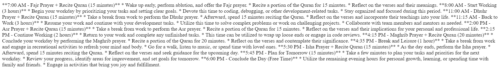

# Google Gemini API - PHP

This PHP code calls the Google Gemini API, which is a powerful generative AI tool.

👉 [Get Gemini API Key](https://aistudio.google.com/app/apikey)

Gemini is a family of large language models ([LLMs](https://www.cloudflare.com/learning/ai/what-is-large-language-model/)) developed by [Google DeepMind](https://deepmind.google/). It's known for its:

✨ **Multimodality:** It can understand and process different types of information, including text, code, audio, image, and video. This allows it to perform various tasks beyond just text analysis.

📈 **Scalability:** It comes in different sizes (Nano, Pro, Ultra) catering to different needs, offering a balance between performance and resource efficiency.

⚡ **State-of-the-art performance:** It achieves impressive results on various benchmarks, including surpassing human experts in some areas.

## Key features

🖊️ **Text-to-text generation:** Can create different creative text formats, like poems, code, scripts, musical pieces, emails, letters, etc.

🦾 **Machine translation:** Can translate between languages accurately and fluently.

❓ **Question answering:** Can answer your questions in a comprehensive and informative way, even for open ended, challenging, or strange questions.

🕓 **Long-context understanding:** Can process and understand information from longer stretches of text, allowing for more nuanced responses.

💻 **Code understanding and generation:** Can understand and analyze code, and even generate different kinds of code.

## Sample code

```php
<?php

    function generateAIContent($apiKey, $prompt) {
        $url = "https://generativelanguage.googleapis.com/v1beta/models/gemini-pro:generateContent?key={$apiKey}";

        $postData = json_encode([
            "contents" => [
                [
                    "parts" => [
                        ["text" => $prompt]
                    ]
                ]
            ]
        ]);

        $ch = curl_init($url);
        curl_setopt($ch, CURLOPT_CUSTOMREQUEST, "POST");
        curl_setopt($ch, CURLOPT_POSTFIELDS, $postData);
        curl_setopt($ch, CURLOPT_RETURNTRANSFER, true);
        curl_setopt($ch, CURLOPT_HTTPHEADER, [
            'Content-Type: application/json',
            'Content-Length: ' . strlen($postData)
        ]);

        $response = curl_exec($ch);
        curl_close($ch);

        $responseData = json_decode($response, true);

        if (isset($responseData['candidates'][0]['content']['parts'][0]['text'])) {
            return $responseData['candidates'][0]['content']['parts'][0]['text'];
        } else {
            return "No generated text found.";
        }
    }

    $apiKey = "---";
    $prompt = "As a developer, give me my daily work plan with daily 5 times prayers, including reciting the Quran.";

    $generatedText = generateAIContent($apiKey, $prompt);
    echo $generatedText;
```

## Add your API key here

```php
$apiKey = "add_your_api_key_here";

```

## Add your prompt here

```php
$prompt = "add_your_prompt_here";

```

### Result look like



## Further Work

### Additional tasks include implementing the safetySettings parameter: 

```php
$postData = json_encode([
		"contents" => [
			[
				"parts" => [
					["text" => $prompt]
				]
			]
		],
		"generationConfig" => [
			"temperature" => 0.9,
			"topK" => 1,
			"topP" => 1,
			"maxOutputTokens" => 2000,
			"stopSequences" => []
		],
		"safetySettings" => [
			[
				"category" => "HARM_CATEGORY_HARASSMENT",
				"threshold" => "BLOCK_ONLY_HIGH"
			],
			[
				"category" => "HARM_CATEGORY_HATE_SPEECH",
				"threshold" => "BLOCK_ONLY_HIGH"
			],
			[
				"category" => "HARM_CATEGORY_SEXUALLY_EXPLICIT",
				"threshold" => "BLOCK_ONLY_HIGH"
			],
			[
				"category" => "HARM_CATEGORY_DANGEROUS_CONTENT",
				"threshold" => "BLOCK_ONLY_HIGH"
			]
		]
	]);
```
### Enhancing the visual presentation of the result using CSS for improved aesthetics.

Coding is poetry, keep coding! 💻 🚀

